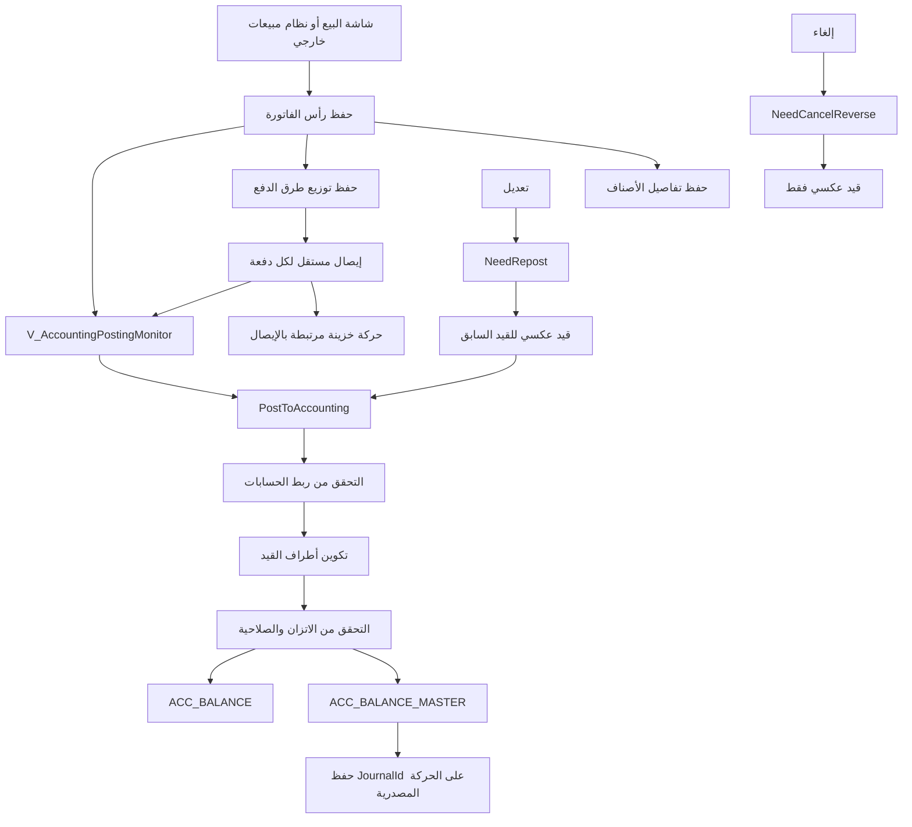

# توثيق الربط المحاسبي بين نظام المبيعات والحسابات في CPOS

> **حالة الوثيقة:** مرجع فني وتشغيلي للبنية الحالية وخطة التوسعة المستقبلية  
> **تاريخ المراجعة:** 2026-09-14  
> **نطاق المراجعة:** مشروع `CPOS` وقاعدة `CPOS_ACCOUNTING` المرتبطة ببيئة التطوير  
> **مهم:** هذه الوثيقة تصف السلوك الفعلي الذي تمت مراجعته في الكود وإجراءات قاعدة البيانات، وتفصل بوضوح بين الموجود حاليا والتوصيات المستقبلية.

---

## 1. الهدف من الوثيقة

تهدف هذه الوثيقة إلى أن تكون المرجع الرئيسي لفهم وإدارة الربط بين نظام المبيعات ونظام الحسابات في CPOS، بحيث تساعد على:

- فهم دورة فاتورة البيع من الحفظ التشغيلي حتى إنشاء القيد المحاسبي.
- فهم ارتباط الفاتورة بالإيصالات وطرق الدفع وحركات الخزينة.
- فهم حالات التعديل، وإعادة التقييد، والإلغاء، والقيد العكسي.
- معرفة الحسابات والإعدادات المطلوبة قبل تشغيل الربط.
- منع الكتابة الخاطئة أو المكررة في جداول اليومية المحاسبية.
- وضع عقد تكامل واضح عند إضافة نظام مبيعات جديد مستقبلا.
- توفير قائمة اختبارات ومراقبة ومطابقة تساعد المطور والمحاسب ومسؤول قاعدة البيانات.

لا تعد هذه الوثيقة بديلا عن النسخ الاحتياطية أو اختبارات قاعدة تجريبية، ولا تمنح أي نظام خارجي صلاحية الكتابة المباشرة في جداول القيود المحاسبية.

---

## 2. الملخص التنفيذي

الربط الحالي يتكون من طبقتين منفصلتين منطقيا:

1. **الطبقة التشغيلية:** تحفظ الفاتورة والأصناف والإيصالات وحركات الخزينة.
2. **الطبقة المحاسبية:** تقرأ الحركة التشغيلية المعتمدة، تتحقق من الحسابات والاتزان، ثم تنشئ قيد اليومية وتحفظ رقم القيد على الحركة المصدرية.

الحفظ التشغيلي لفاتورة البيع لا يعني بالضرورة أن قيدها المحاسبي قد أُنشئ. الحركات تظهر في شاشة مراقبة الترحيل المحاسبي، ومنها يتم تنفيذ أحد الإجراءات التالية:

- تقييد الحركة لأول مرة.
- إعادة تقييدها بعد تعديلها.
- إنشاء قيد عكسي بعد إلغائها.
- عدم اتخاذ إجراء عندما تكون حالتها سليمة ومكتملة.

المبدأ الأهم عند إضافة نظام مبيعات آخر هو:

> **يجب ألا يكتب النظام الجديد مباشرة في `ACC_BALANCE_MASTER` أو `ACC_BALANCE`.**  
> عليه إنشاء حركة مصدر صحيحة من خلال عقد تكامل معتمد، ثم تمريرها إلى نفس محرك التحقق والترحيل المستخدم في CPOS.

هذا يحافظ على مصدر واحد لقواعد المحاسبة، ويمنع اختلاف القيود بين شاشات البيع أو الأنظمة المتصلة.

---

## 3. حدود المسؤولية ومصادر الحقيقة

### 3.1 مصدر الحقيقة التشغيلي

مصدر الحقيقة للفاتورة وتفاصيلها ومدفوعاتها هو جداول الحركة التشغيلية، وأهمها:

| الجدول | المسؤولية |
|---|---|
| `Agents_Balance_MV` | رأس الفاتورة أو الحركة المرتبطة بالعميل/المورد |
| `SB_Contents` | تفاصيل أصناف فاتورة البيع |
| `Agents_Balance_MV_RCT` | إيصالات القبض والصرف المرتبطة بالفاتورة |
| `Treasury_Balance_MV` | الأثر النقدي لكل إيصال على الخزينة |
| `AG_MV_TRANSACTION` | التحويلات بين حسابات العملاء/الوكلاء |

### 3.2 مصدر الحقيقة المحاسبي

| الجدول | المسؤولية |
|---|---|
| `ACC_BALANCE_MASTER` | رأس قيد اليومية، رقمه، تاريخه، مصدره، وحالة العكس |
| `ACC_BALANCE` | أطراف القيد والحسابات والقيم والعملات ومراكز التكلفة |

### 3.3 مصدر الحقيقة لقواعد الترحيل

الإجراءات المخزنة الخاصة بالترحيل هي المرجع النهائي لطريقة بناء القيد، ومن أهمها:

- `PostToAccounting`
- `PostAgentBalanceInvoiceToAccounting`
- `PostAgentBalanceReceiptToAccounting`
- `PostAgentBalancetTransacionToAccounting`
- `PostTrTransacionToAccounting`
- `ACC_SYSTEM_ACCOUNT_VALIDATE_FOR_POSTING`
- `ACC_BALANCE_proc_BULK`

إذا تعارض وصف قديم أو شاشة قديمة مع منطق الإجراء الفعلي، فيجب إيقاف التعديل والتحقق من الإجراء والبيانات على قاعدة تجريبية قبل اعتماد أي تغيير.

---

## 4. الرسم العام للبنية



---

## 5. الجداول والحقول المحورية

### 5.1 جدول `Agents_Balance_MV`

يمثل رأس الحركة التشغيلية، ويحتوي على أربعة أنواع من البيانات المهمة:

#### تعريف الحركة

- `T_ID`: المعرف الداخلي للحركة.
- `AG_ID`: العميل أو المورد أو الجهة.
- `BsType_ID`: نوع الحركة.
- `SB_ID`: رقم فاتورة البيع عند توفره.
- حقول مراجع أخرى مثل `S_Bill_Pr_ID` و`Pch_ID` و`SRtn_ID` و`PRtn_ID` بحسب نوع الحركة.

#### القيم المالية

- `Total`: الإجمالي.
- `Discount`: الخصم.
- `Pure`: الصافي.
- `Pied`: المدفوع.
- `Debit` و`Credit`: حقول مالية تاريخية تستخدمها البنية الحالية.

#### الحالة التشغيلية

- `isDepended`: اعتماد الحركة.
- `isVoid`: إلغاء الحركة.
- `isPied`: حالة الدفع.
- `Date`: تاريخ الحركة.
- `User_ID`: المستخدم المنفذ.

#### دورة الحياة المحاسبية

- `JournalId`: القيد المحاسبي الحالي المرتبط بالحركة.
- `PostedAt`, `PostedBy`: معلومات آخر ترحيل.
- `OriginalJournalId`: القيد الأصلي قبل أول إعادة تقييد.
- `LastReversalJournalId`: آخر قيد عكسي بسبب تعديل.
- `NeedRepost`: الحركة تغيرت وتحتاج إعادة تقييد.
- `EditVersion`, `EditOpenedAt`, `EditOpenedBy`: معلومات فتح وتتابع التعديل.
- `LastRepostAt`, `LastRepostBy`: معلومات آخر إعادة تقييد.
- `VoidAt`, `VoidBy`, `VoidReason`: معلومات الإلغاء.
- `VoidReversalJournalId`: القيد العكسي الناتج عن الإلغاء.
- `NeedCancelReverse`: الإلغاء يحتاج إلى قيد عكسي.

### 5.2 جدول `Agents_Balance_MV_RCT`

يمثل سند القبض أو الصرف، ويرتبط بالفاتورة من خلال:

- `Receipt_Tran_ID`: معرف الحركة الأصلية في `Agents_Balance_MV`.
- `Pay_ID`: طريقة الدفع.
- `Tr_ID`: الخزينة أو الحساب النقدي المستخدم.

يحتفظ الجدول أيضا بالقيم وحالة الإلغاء والاعتماد، وبنفس مجموعة حقول دورة الحياة المحاسبية تقريبا: `JournalId`, `NeedRepost`, `NeedCancelReverse` وحقول العكس والتعديل.

### 5.3 جدول `Treasury_Balance_MV`

يمثل الأثر الفعلي على الخزينة. يرتبط بالإيصال من خلال `AGBalance_T_ID`، ويحتوي على:

- `Tr_ID`: الخزينة.
- `Debit`, `Credit`, `Pure`: قيمة واتجاه الحركة وفقا لاتفاقية النظام الحالية.
- `isVoid`: استبعاد الحركة الملغية.
- بيانات التحويل عند كون الحركة تحويل خزينة.
- حقول الترحيل وإعادة الترحيل والإلغاء المحاسبي.

### 5.4 جدول `SB_Contents`

يمثل تفاصيل البيع ويحتوي، حسب البنية الحالية، على:

- `Bill_T_ID`: معرف رأس الفاتورة.
- `IM_ID`: الصنف.
- `U_ID`: الوحدة.
- `ST_ID`: المخزن.
- الكمية والسعر والإجمالي والتكلفة.
- `isDepended`: اعتماد السطر.

تستخدم بيانات المخزن والتكلفة لبناء قيد تكلفة البضاعة والمخزون، لذلك لا يكفي إرسال إجمالي الفاتورة فقط إلى الربط المحاسبي.

---

## 6. أنواع الحركات ذات العلاقة

القيم التالية موجودة في البنية التشغيلية الحالية، لكن دعم الترحيل الفعلي يجب أن يؤخذ دائما من إجراء الترحيل وليس من الاسم وحده:

| `BsType_ID` | المعنى التشغيلي |
|---:|---|
| 1 | فاتورة مبيعات |
| 2 | مصروف عام |
| 3 | سند قبض |
| 4 | سند صرف |
| 5 | استحقاق راتب |
| 6 | رصيد افتتاحي مدين |
| 7 | فاتورة مشتريات |
| 8 | تلف |
| 9 | جرد مخزون |
| 10 | مرتجع مبيعات |
| 11 | مرتجع مشتريات |
| 12 | تحويل مخزني |
| 14 | استهلاك تصنيع |
| 37 | رصيد افتتاحي دائن |
| 39 | تسوية كمية/مخزون |
| 40 | تحويل بين الحسابات |

الإجراء `PostAgentBalanceInvoiceToAccounting` يعالج حاليا الأنواع الرئيسية: 1، 2، 5، 7، 8، 9، 10، 11، 12، 14، 39، إضافة إلى الأرصدة الافتتاحية 6 و37.

وجود نوع في جدول الأنواع لا يعني تلقائيا أن له خريطة قيد مكتملة. يجب اختبار كل نوع قبل السماح لنظام خارجي بإنشائه.

---

## 7. دورة فاتورة البيع الحالية

### 7.1 الحفظ التشغيلي

عند حفظ فاتورة بيع يجب أن تتكون وحدة العمل من:

1. إنشاء رأس في `Agents_Balance_MV` بنوع حركة بيع.
2. إنشاء تفاصيل صحيحة في `SB_Contents`.
3. حساب الإجمالي والخصم والصافي على الخادم قدر الإمكان.
4. إنشاء إيصال لكل طريقة دفع، إن وُجد دفع.
5. إنشاء حركة الخزينة المقابلة لكل إيصال.
6. تنفيذ جميع الخطوات داخل معاملة قاعدة بيانات واحدة، أو إلغاء العملية كاملة عند الخطأ.

### 7.2 الفاتورة الآجلة

يمكن أن تكون الفاتورة بدون دفع، أو بدفع جزئي، عندما تسمح سياسة العميل بذلك. لا يجوز تحويل الرصيد غير المدفوع إلى طريقة دفع وهمية؛ يبقى رصيدا على العميل.

### 7.3 العميل ذو الدفع الآلي

عندما يكون العميل مضبوطا كعميل دفع آلي، يجب أن يساوي مجموع الدفعات الصافي المطلوب للفاتورة. الإجراءات الحديثة تتحقق من ذلك داخل قاعدة البيانات، وليس في الواجهة فقط.

### 7.4 الدفع المتعدد

الدفع المتعدد لا يعني إنشاء إيصال واحد يحمل وصفا مركبا، بل:

- سطر دفع مستقل لكل طريقة دفع.
- إيصال مستقل لكل سطر.
- حركة خزينة مستقلة مرتبطة بالإيصال.
- إمكان تقييد كل إيصال ومراجعته وإلغائه بصورة مستقلة.

مثال: صافي الفاتورة 100، منها 40 نقدا و60 بطاقة:

| السطر | طريقة الدفع | الخزينة | المبلغ |
|---:|---|---|---:|
| 1 | نقدي | خزينة الصندوق | 40.000 |
| 2 | بطاقة | خزينة/حساب البطاقة | 60.000 |

مجموع الدفعات هنا يساوي 100.000، لكن الفاتورة تظل حركة واحدة وتفاصيلها تظل مجموعة واحدة.

---

## 8. عقد الدفع المتعدد الحالي

نوع الجدول `SalePaymentAllocationType` يمثل العقد المرسل إلى الإجراءات الحديثة:

| الحقل | النوع | الغرض |
|---|---|---|
| `LineNo` | `INT` | رقم فريد للسطر داخل الطلب |
| `PaymentMethodID` | `INT` | طريقة الدفع |
| `TreasuryID` | `INT` | الخزينة المرتبطة |
| `Amount` | `DECIMAL(18,3)` | مبلغ الدفعة |
| `ReferenceNumber` | `NVARCHAR(100)` | رقم مرجع البطاقة أو التحويل |
| `BankName` | `NVARCHAR(150)` | اسم المصرف عند الحاجة |
| `CheckNumber` | `NVARCHAR(100)` | رقم الشيك عند الحاجة |
| `Notes` | `NVARCHAR(500)` | ملاحظات إضافية |

الإجراءات الأساسية المستخدمة هي:

- `SB_ConfermBill_V2`: اعتماد فاتورة موجودة وإنشاء مدفوعاتها.
- `PushSalesDraft_V2`: إنشاء فاتورة المسودة وتفاصيلها ومدفوعاتها كوحدة واحدة.
- `Agents_BalanceMV_insert_RCT`: إنشاء الإيصال وأثره على الخزينة.

### 8.1 قواعد التحقق المهمة

- قيمة كل سطر دفع يجب أن تكون موجبة.
- طريقة الدفع يجب أن تكون موجودة وصالحة.
- الخزينة يجب أن تكون موجودة.
- يجب احترام إعداد الخزينة الافتراضية أو المقفلة لطريقة الدفع.
- لا يقبل تكرار `LineNo` في الطلب نفسه.
- مجموع المدفوعات يجب أن يطابق قيمة `Pied` المرسلة.
- للعميل ذي الدفع الآلي يجب أن يطابق المجموع صافي الفاتورة.
- يجب احتساب الصافي من الإجمالي ناقص الخصم، وعدم الاعتماد على قيمة غير موثقة من الواجهة.

### 8.2 تنبيه حول `PaymentMethodDefaultAccounts`

رغم اسم الجدول، فإن السلوك الحالي للإجراءات الحديثة يقارن `AccountID` فيه بمعرف الخزينة `TreasuryID`. لذلك يجب التعامل معه حاليا كربط بين طريقة الدفع والخزينة/حساب التحصيل التشغيلي، وعدم افتراض أنه يمثل مباشرة حساب الأستاذ العام دون مراجعة الإجراء.

أي تغيير مستقبلي لمعنى هذا الجدول يجب أن يتم بترحيل واضح ومتوافق، لأن تغيير تفسيره فقط في الواجهة سيؤدي إلى اختلاف بين الحفظ والتحقق والترحيل.

---

## 9. القيد المحاسبي لفاتورة البيع

المعنى المحاسبي المقصود لفاتورة البيع هو، بصورة مفاهيمية:

### 9.1 قيد الإيراد والذمة

- العميل: بصافي الفاتورة.
- الخصم المسموح: بقيمة الخصم، إن وجد.
- إيراد المبيعات: بإجمالي البيع.

وفق العرض المحاسبي التقليدي يكون العميل والخصم في الطرف المدين، والإيراد في الطرف الدائن.

### 9.2 قيد التكلفة والمخزون

- تكلفة البضاعة المباعة: بتكلفة الأصناف.
- مخزون كل مخزن: بقيمة التكلفة الخارجة منه.

يجب تجميع التكلفة حسب المخزن/حساب المخزون، خصوصا عندما تحتوي الفاتورة على أصناف من أكثر من مخزن.

### 9.3 قيد القبض

إيصال القبض ينقل القيمة من ذمة العميل إلى الخزينة المحددة في سطر الدفع، مع معالجة خصم السداد إن كان مستخدما في الحركة.

بهذه البنية تكون الفاتورة مستقلة عن وسيلة الدفع: الفاتورة تنشئ الإيراد والذمة، والإيصالات تسوي الذمة مقابل الخزائن المختلفة.

### 9.4 تنبيه مهم حول أسماء `Debit` و`Credit`

توجد في الإجراءات الحالية مواضع تشير تعليقاتها المحاسبية إلى طرف مدين، بينما توضع القيمة تقنيا في عمود اسمه `CREDIT`، والعكس في بعض المسارات التاريخية. لذلك:

> لا يجوز تبديل الأعمدة أو “تصحيحها” اعتمادا على المصطلح المحاسبي وحده.

قبل أي تعديل يجب التحقق من:

- طريقة عرض كشف الحساب والميزان.
- طريقة تفسير `ACC_BALANCE_proc_BULK` للأعمدة.
- أثر قيد تجريبي على ميزان المراجعة.
- إجراءات العكس والتقارير المبنية على البنية الحالية.

القاعدة الآمنة هي المحافظة على اتفاقية قاعدة CPOS الحالية، واستخدام إجراء الترحيل نفسه لجميع الأنظمة المتصلة.

---

## 10. مرتجعات المبيعات

مرتجع المبيعات يجب أن يرتبط بالفاتورة الأصلية كلما أمكن، ويعكس الأثر الاقتصادي للأجزاء المرتجعة:

- تخفيض ذمة العميل أو إنشاء مبلغ مستحق له.
- إثبات حساب مردودات المبيعات.
- إعادة تكلفة الأصناف إلى المخزون.
- عكس تكلفة البضاعة المباعة بالقدر المرتجع.

أما رد المبلغ للعميل فهو حركة دفع/صرف مستقلة، ويمكن أن يتوزع على طرق الدفع وفقا لسياسة الاسترداد.

ينبغي ألا يفترض النظام أن طريقة رد المبلغ هي دائما نفس طريقة الدفع الأصلية، لكن يجب أن يعرض المدفوعات الأصلية ويطبق سياسة المؤسسة، مثل:

- رد البطاقة إلى نفس مرجع البطاقة عند إلزام مزود الدفع.
- رد النقد إلى خزينة مخولة.
- منع رد مبلغ على طريقة دفع يتجاوز الصافي القابل للاسترداد منها، إن كانت هذه هي السياسة المعتمدة.

---

## 11. إعدادات وربط الحسابات

### 11.1 الحسابات النظامية

تعرف الأنواع الدلالية في `ACC_SYSTEM_ACCOUNT_TYPES`، وتربط بالحسابات الفعلية في `ACC_SYSTEM_ACCOUNT_LINKS`.

الأنواع المهمة الموجودة حاليا:

| ID | الكود | الحالة/الاستخدام العام |
|---:|---|---|
| 1 | `SALES_REVENUE` | مطلوب؛ إيراد المبيعات |
| 2 | `SALES_RETURN` | مطلوب؛ مردودات المبيعات |
| 3 | `PURCHASES` | مطلوب؛ المشتريات |
| 4 | `PURCHASE_RETURN` | مطلوب؛ مردودات المشتريات |
| 5 | `INVENTORY` | اختياري حسب التصميم |
| 6 | `COGS` | مطلوب؛ تكلفة البضاعة المباعة |
| 7 | `CUSTOMER_CONTROL` | حساب رقابة العملاء؛ اختياري/أب |
| 8 | `SUPPLIER_CONTROL` | حساب رقابة الموردين؛ اختياري/أب |
| 9 | `DISCOUNT_ALLOWED` | مطلوب؛ الخصم المسموح |
| 10 | `DISCOUNT_RECEIVED` | مطلوب؛ الخصم المكتسب |
| 11 | `VAT_OUTPUT` | اختياري؛ ضريبة المخرجات |
| 12 | `VAT_INPUT` | اختياري؛ ضريبة المدخلات |
| 13 | `ROUNDING_DIFF` | اختياري؛ فروقات التقريب |
| 14 | `PROFIT_LOSS` | اختياري/أب |
| 15 | `CAPITAL` | مطلوب/أب |
| 16 | `DAMAGE_EXPENSE` | مطلوب؛ مصروف التلف |
| 17 | `MANUFACTURING_EXPENSE` | اختياري؛ قد يستخدم `COGS` كبديل حسب المنطق الحالي |
| 18 | `INVENTORY_ADJUSTMENT_GAIN` | اختياري؛ أرباح تسوية المخزون |
| 19 | `INVENTORY_ADJUSTMENT_LOSS` | اختياري؛ خسائر تسوية المخزون |
| 20 | `GENERAL_EXPENSE` | اختياري؛ المصروف العام |
| 21 | `OPENING_BALANCES` | مطلوب؛ الأرصدة الافتتاحية |
| 22 | `PAYROLL_WAGE_CAlCULATION` | اختياري؛ احتساب الأجور |

قيم `Expected_ACC_NATURAL` هي قواعد تحقق مبرمجة داخل النظام. يجب عدم إعادة تفسير الحروف `D/C` بمعزل عن اتفاقية قاعدة البيانات التاريخية.

### 11.2 حسابات الكيانات الديناميكية

تدار قواعد الحسابات الفرعية بواسطة:

- `ACC_ENTITY_RULES`
- `ACC_ENTITY_LINKS`

القواعد الحالية تتضمن:

| نوع الكيان | المصدر | الحساب الأب الحالي | ملاحظات |
|---|---|---:|---|
| حساب عام | `Agents` | 5101 | فعال |
| عميل | `Agents` | 125 | فعال |
| مورد | `Agents` | 211 | فعال |
| موظف | `Agents` | 211 | فعال |
| مخزن | `Stores` | 114 | فعال |
| خزينة | `TreasuryCard` | 111 | فعال |
| مصروف عام | `Expenses_Card` | 42 | فعال |
| مصروف مشتريات | `Pch_Exp_Card` | 312 | غير فعال حاليا |
| مصرف | `TreasuryCard` | 112 | فعال |

تسمح القواعد الحالية بالإنشاء الآلي وإعادة التسمية، ولا تسمح افتراضيا بتغيير الحساب الأب أو حذف الحساب عند فقد الارتباط.

### 11.3 الارتباطات القديمة المباشرة

توجد أيضا حقول `Tree_Code` مباشرة في كيانات مثل العملاء والخزائن والمخازن أو عروضها. هذا يعني أن النظام يحتوي حاليا على مصدرين محتملين لبعض الارتباطات:

- الربط الديناميكي عبر `ACC_ENTITY_LINKS`.
- الربط المباشر القديم عبر `Tree_Code`.

يجب وضع سياسة مزامنة واضحة بينهما. لا يجوز لنظام خارجي تحديث أحدهما وترك الآخر دون معرفة أيهما يقرأه إجراء الترحيل الفعلي.

### 11.4 شاشات الإدارة ذات العلاقة

- `FrmSystemAccountLinks`
- `FrmSystemAccountTypeEdit`
- `FrmSystemAccountLinksLog`
- `FRM_ACC_ENTITY_LINKS_MANAGER`
- `FRM_ACC_ENTITY_RULES_MANAGER`
- `frmPaymentDefaultAccount`

الوصول إلى بوابة الإدارة مرتبط بالميزة `Sys_Features.Use_AccountingPortal` المحملة في الإعداد `S_Use_AccountingPortal`.

---

## 12. التحقق قبل إنشاء القيد

قبل حفظ قيد محاسبي يتحقق المحرك، بحسب المسار، من الآتي:

- وجود كل حساب نظامي مطلوب.
- وجود الحساب في `ACCOUNTS_TREE`.
- أن الحساب غير مقفل.
- أن الحساب حساب حركة/ورقة وليس حسابا أبا عندما يشترط ذلك.
- عدم وجود ازدواج حسابات محظور بين أنواع الحسابات النظامية.
- أن لكل سطر طرفا واحدا غير صفري فقط.
- عدم وجود قيمة سالبة غير مسموحة.
- صحة العملة ومركز التكلفة.
- اتزان إجمالي طرفي القيد بعد التقريب إلى ثلاث منازل.
- نجاح الحفظ الجماعي وعودة معرف قيد صالح.

تنفذ هذه الضوابط عبر `ACC_SYSTEM_ACCOUNT_VALIDATE_FOR_POSTING`، والعروض المساعدة، ثم `ACC_BALANCE_proc_BULK`.

بعد النجاح يحدث المصدر بقيم `JournalId`, `PostedAt`, `PostedBy`. إذا لم يحدث المصدر، فلا تعتبر العملية مكتملة حتى لو وجد قيد غير مرتبط؛ يجب التحقيق والمطابقة.

---

## 13. شاشة مراقبة الترحيل وحالات الحركة

العرض `V_AccountingPostingMonitor` يوحد حاليا المصادر التالية:

| `SourceTable` | المصدر |
|---|---|
| `MV` | الحركات في `Agents_Balance_MV` |
| `RCT` | الإيصالات في `Agents_Balance_MV_RCT` |
| `AG_TRN` | تحويلات حسابات العملاء/الوكلاء |
| `TR_TRN` | تحويلات الخزائن مجمعة حسب رقم التحويل |

ويحدد الإجراء المطلوب حسب الحالة:

| الحالة | المعنى | الإجراء |
|---|---|---|
| فعالة، بلا قيد، ولا تحتاج إعادة | لم ترحل بعد | `POST_FIRST_TIME` |
| فعالة، لها قيد، وتحتاج إعادة | عدلت بعد الترحيل | `REPOST` |
| فعالة، لها قيد، ولا تحتاج إعادة | سليمة ومقيدة | `NO_ACTION` |
| ملغية، لها قيد، وتحتاج عكسا | إلغاء غير مكتمل محاسبيا | `CANCEL_REVERSE` |
| ملغية، لها قيد عكسي | ملغية ومعكوسة | `VOID_REVERSED` |
| ملغية، بلا قيد أصلي | لا أثر محاسبي لعكسه | `VOID_NO_ACTION` |
| بلا قيد مع `NeedRepost=1` | حالة غير طبيعية | `CHECK` |

تستخدم شاشة `FrmAccountingPostingMonitor` الإجراء الجامع:

```sql
EXEC dbo.PostToAccounting
    @SourceTable = @SourceTable,
    @T_ID         = @T_ID,
    @UserId       = @UserId,
    @PostingAction = @PostingAction;
```

### 13.1 التوجيه داخل `PostToAccounting`

| الإجراء | `MV` | `RCT` | `AG_TRN` | `TR_TRN` |
|---|---|---|---|---|
| `POST_FIRST_TIME` | فاتورة/حركة | إيصال | تحويل حسابات | تحويل خزائن |
| `REPOST` | مدعوم | مدعوم | غير موجه حاليا | غير موجه حاليا |
| `CANCEL_REVERSE` | مدعوم | مدعوم | غير موجه حاليا | غير موجه حاليا |

يجب الانتباه إلى هذا القيد عند توسيع تعديل أو إلغاء التحويلات.

### 13.2 طبيعة الترحيل الحالية

البحث في مسار الحفظ أكد أن الترحيل الأول ليس جزءا آليا من تأكيد البيع في الشاشات التي تمت مراجعتها؛ تتم إدارة الترحيل من شاشة المراقبة/البوابة. لذلك يوجد فصل زمني محتمل بين:

- فاتورة محفوظة تشغيليا.
- فاتورة مقيدة محاسبيا.

هذا تصميم **اتساق لاحق** وليس معاملة موزعة واحدة. يجب أن تظهر الحركات غير المقيدة في المراقبة، وأن تتم متابعتها يوميا.

---

## 14. تعديل فاتورة مقيدة

تعديل القيد الأصلي مباشرة ممارسة غير آمنة، لأنه يمحو الأثر التاريخي. المسار الحالي يعتمد العكس وإعادة الإنشاء:

1. فتح الفاتورة للتعديل عبر `Agents_Balance_MV_OpenForEdit`.
2. إذا كان لها `JournalId`، تضبط `NeedRepost=1` ويحفظ القيد الأصلي.
3. تحفظ التغييرات التشغيلية.
4. عند `REPOST` يستدعى `Agents_Balance_MV_ConfirmEditAndRepost`.
5. ينشأ قيد عكسي للقيد السابق عبر `ACC_BALANCE_Insert_reverse`.
6. ينشأ قيد جديد من الحالة الحالية للفاتورة.
7. تحدث مراجع القيد والعكس والإصدار والتواريخ.
8. تسجل العملية في `ACC_InvoiceRepostLog`.

الإيصالات تتبع المسار نفسه عبر إجراءات `Agents_Balance_MV_RCT_*`.

### 14.1 تسوية مدفوعات الفاتورة المعدلة

الإجراء `SB_ReconcileEditedBillPayments_V2` يعالج فرق الصافي دون تعديل الإيصالات الأصلية:

- يحتسب صافي المدفوع الفعلي من سندات القبض ناقص سندات الصرف، مع استبعاد الملغي.
- يقارن الصافي الجديد بالقيمة المدفوعة الحالية.
- إذا زاد المطلوب، ينشئ سند قبض تسوية.
- إذا نقص المطلوب، ينشئ سند صرف/استرداد تسوية.
- يحافظ على تاريخ المدفوعات الأصلي ويضيف حركات تصحيحية مستقلة.
- يمنع استردادا يتجاوز المبلغ القابل للاسترداد لطريقة الدفع/الخزينة حسب قواعده.
- ينفذ العملية داخل معاملة ويعيد التحقق من التطابق النهائي.

هذا المسار يطبق حاليا على العملاء ذوي الدفع الآلي. الفواتير الآجلة أو المدفوعة جزئيا تحتاج قرارا واضحا من المستخدم/السياسة ولا ينبغي تسويتها آليا دون تحديد المقصود.

---

## 15. إلغاء فاتورة أو إيصال مقيد

الإلغاء التشغيلي والقيد العكسي مرحلتان مترابطتان:

1. إجراء الإلغاء يضبط `isVoid` وبيانات المنفذ والسبب.
2. إذا وجد `JournalId`، تضبط `NeedCancelReverse=1`.
3. تظهر الحركة في المراقبة بإجراء `CANCEL_REVERSE`.
4. ينشأ قيد عكسي باستخدام `ACC_BALANCE_Insert_reverse`.
5. يحفظ معرفه في `VoidReversalJournalId` وتغلق علامة الاحتياج.

لا يجوز حذف القيد الأصلي أو الفاتورة لإتمام الإلغاء.

يوجد جدول `ACC_InvoiceCancelLog` في القاعدة، لكن إجراءات العكس بسبب الإلغاء التي تمت مراجعتها لا يظهر فيها تسجيل صريح مماثل لتسجيل إعادة التقييد. هذه نقطة تدقيق يجب حسمها قبل اعتبار سجل الإلغاءات مكتمل المراجعة.

---

## 16. التصميم الموصى به لربط نظام مبيعات جديد

### 16.1 المبدأ

يجب إنشاء **محول تكامل Accounting/Sales Adapter** بين النظام الجديد وCPOS. مسؤولية المحول هي تحويل مستند البيع الخارجي إلى عقد CPOS القانوني، وليس إعادة كتابة قواعد القيود.


### 16.2 الخيار الأقرب للبنية الحالية

أن يستخدم المحول إجراء مخزنا ذا إصدار واضح لإنشاء:

- رأس `Agents_Balance_MV`.
- تفاصيل `SB_Contents`.
- توزيع `SalePaymentAllocationType`.
- الإيصالات وحركات الخزينة من الإجراءات المعتمدة.

بعدها تظهر الحركة تلقائيا كمصدر `MV` وإيصالاتها كمصدر `RCT` في مراقبة الترحيل.

### 16.3 الخيار الأقوى للأنظمة الخارجية

إضافة منطقة استقبال مستقلة مثل:

- رأس استيراد.
- تفاصيل استيراد.
- مدفوعات استيراد.
- سجل تنفيذ ونتائج وأخطاء.

ثم إجراء واحد يحول الطلب المعتمد إلى الحركة التشغيلية داخل معاملة. تفيد هذه الطبقة في:

- منع التكرار.
- إعادة المحاولة بأمان.
- الاحتفاظ بالحمولة الخارجية للمراجعة.
- فصل اختلاف أكواد العملاء والأصناف وطرق الدفع.
- عدم منح النظام الخارجي صلاحية مباشرة على الجداول الأساسية.

هذه المنطقة **توصية مستقبلية** وليست جزءا مثبتا من البنية الحالية.

---

## 17. عقد البيانات المطلوب من أي نظام مبيعات جديد

### 17.1 تعريف المصدر ومنع التكرار

يجب توفير:

- `ExternalSystemCode`: كود ثابت للنظام المصدر.
- `ExternalDocumentId`: معرف الفاتورة داخل النظام المصدر.
- `ExternalDocumentVersion`: رقم نسخة التعديل.
- `RequestId`: معرف فريد لمحاولة التكامل.
- نوع الحدث: إنشاء، تعديل، إلغاء.

يجب فرض قيد فريد على الأقل على `(ExternalSystemCode, ExternalDocumentId)`، ومعالجة النسخ بإصدار متزايد. البنية الحالية لا توفر مفتاح تكامل خارجي صريحا على رأس الفاتورة، ولذلك يجب إضافته في طبقة التكامل قبل السماح بإعادة المحاولات التلقائية.

### 17.2 رأس المستند

- نوع المستند.
- رقم وتاريخ الفاتورة وتاريخ المحاسبة.
- العميل.
- المستخدم/الفرع/نقطة البيع.
- العملة وسعر الصرف إن كانا مدعومين.
- الإجمالي والخصم والضريبة والتقريب والصافي.
- حالة الاعتماد والإلغاء.
- مرجع الفاتورة الأصلية عند المرتجع.

### 17.3 التفاصيل

- معرف الصنف ووحدته.
- الكمية والسعر والخصم والضريبة.
- المخزن لكل سطر.
- التكلفة المعتمدة أو البيانات التي تسمح لـCPOS باحتسابها.
- مركز التكلفة عند الاستخدام.
- مرجع السطر الأصلي في حالة المرتجع.

### 17.4 المدفوعات

- رقم السطر.
- طريقة الدفع.
- الخزينة/الحساب التشغيلي.
- المبلغ.
- أرقام مرجع البطاقة أو المصرف أو الشيك عند الحاجة.
- حالة العملية لدى مزود الدفع إذا وجدت.

### 17.5 بيانات الإلغاء والتعديل

- سبب الإلغاء أو التعديل.
- المستخدم المنفذ.
- وقت التنفيذ.
- نسخة المستند السابقة والجديدة.
- مرجع عملية الدفع/الاسترداد الخارجية.

---

## 18. خرائط الأكواد المطلوبة

قبل تشغيل أي نظام جديد يجب إنشاء واعتماد خرائط:

| كيان النظام الجديد | كيان CPOS |
|---|---|
| العميل | `AG_ID` وربط حساب العميل |
| الصنف | `IM_ID` |
| الوحدة | `U_ID` |
| المخزن | `ST_ID` وربط حساب المخزون |
| طريقة الدفع | `Pay_ID` |
| الخزينة/البنك | `Tr_ID` وربط حسابها |
| المستخدم | `User_ID` |
| الفرع/مركز التكلفة | المعرف المعتمد في الحسابات |
| العملة | معرف العملة في CPOS |

قواعد الخريطة:

- لا تستخدم مطابقة الاسم وحده.
- يجب أن يكون لكل كود خارجي مقابل داخلي ثابت وقابل للتدقيق.
- يجب منع الاستيراد عند غياب خريطة إلزامية.
- لا تنشأ حسابات دفتر الأستاذ تلقائيا من نص حر قادم من النظام الخارجي.
- إنشاء العميل أو الخزينة آليا يجب أن يمر عبر قواعد `ACC_ENTITY_RULES`، لا عبر إدخال مباشر في شجرة الحسابات.

---

## 19. واجهة التكامل المقترحة

يمكن تقديم العقد كإجراء مخزن، أو API داخلي يستدعي إجراء مخزنا. الاسم التالي مثال تصميمي:

```text
ImportSalesDocumentV1
```

ويستقبل:

- بيانات المصدر والمفتاح الخارجي.
- رأس المستند.
- TVP للتفاصيل.
- `SalePaymentAllocationType` للمدفوعات.
- هوية المستخدم/الخدمة.

ويعيد نتيجة منظمة:

| الحقل | المعنى |
|---|---|
| `Succeeded` | نجاح العملية بالكامل |
| `ResultCode` | كود ثابت قابل للمعالجة آليا |
| `Message` | وصف آمن للمستخدم أو السجل |
| `T_ID` | معرف حركة CPOS |
| `SB_ID` | رقم الفاتورة الداخلي |
| `PostingStatus` | غير مقيد/مقيد/يحتاج إجراء |
| `IsDuplicate` | الطلب سبق استقباله |
| `CurrentVersion` | النسخة المقبولة حاليا |

### 19.1 قواعد التنفيذ

- المعاملة الواحدة تشمل الرأس والتفاصيل والمدفوعات والحركات التابعة.
- لا تنشأ نتيجة جزئية عند فشل أي جزء.
- إعادة إرسال نفس `RequestId` تعيد النتيجة السابقة ولا تنشئ فاتورة ثانية.
- إرسال نسخة أقدم يرفض.
- إرسال نفس المستند بمحتوى مختلف ومن دون رفع الإصدار يرفض ويسجل كتعارض.
- يحدد بوضوح هل الترحيل المحاسبي متزامن أم يترك للمراقبة الحالية.

التوصية في البداية هي إبقاء الترحيل عبر المراقبة الحالية، حتى لا يؤدي تعطل الحسابات إلى فقد البيع التشغيلي. وإذا اعتمد ترحيل آلي لاحقا، فيجب استخدام طابور وإعادة محاولة، لا استدعاء غير مضبوط من شاشة البيع.

---

## 20. الصلاحيات والأمان

الخدمة الخارجية يجب أن تحصل على أقل صلاحيات ممكنة:

- تنفيذ إجراءات التكامل المعتمدة فقط.
- لا صلاحية `INSERT/UPDATE/DELETE` مباشرة على جداول اليومية.
- لا صلاحية تعديل `JournalId` أو أعلام الترحيل.
- لا صلاحية تعديل ربط الحسابات النظامية.
- لا صلاحية إلغاء مستند دون إجراء الإلغاء الرسمي وسبب وهوية منفذ.

ينبغي تسجيل:

- النظام المصدر.
- معرف الطلب.
- المستخدم أو حساب الخدمة.
- وقت الاستقبال والنتيجة.
- معرفات CPOS الناتجة.
- رسالة الخطأ الفنية المختصرة.
- بصمة للحمولة لمنع اختلاف إعادة الإرسال.

يجب ألا تحتوي سجلات الأخطاء على كلمة مرور قاعدة البيانات أو بيانات بطاقات حساسة كاملة.

---

## 21. إدارة الأخطاء وإعادة المحاولة

تقسم الأخطاء إلى:

### 21.1 أخطاء بيانات غير قابلة لإعادة المحاولة تلقائيا

- عميل أو صنف أو مخزن بلا خريطة.
- حساب مطلوب غير مربوط أو مقفل.
- عدم اتزان المستند.
- مرجع مرتجع غير صالح.
- طريقة دفع أو خزينة غير مسموحة.
- نسخة مستند قديمة أو متعارضة.

هذه الأخطاء تحتاج تصحيح البيانات أو الإعدادات، ثم إعادة الطلب بنفس المفتاح مع آلية النسخة المناسبة.

### 21.2 أخطاء تقنية قابلة لإعادة المحاولة

- انقطاع الاتصال.
- مهلة مؤقتة.
- قفل أو تعارض متزامن عابر.
- توقف خدمة التكامل.

تعاد المحاولة تدريجيا، مع المحافظة على `RequestId` نفسه لضمان عدم التكرار.

### 21.3 نتيجة غير مؤكدة

إذا انقطع الاتصال بعد إرسال الطلب وقبل استلام الرد، لا ترسل فاتورة جديدة بمعرف جديد. يستعلم النظام أولا عن حالة `RequestId` أو يعيد الطلب نفسه؛ طبقة التكامل هي التي تقرر هل نفذ سابقا.

---

## 22. المطابقة والرقابة اليومية

ينبغي تنفيذ مطابقة على ثلاثة مستويات:

### 22.1 المستندات

- عدد وقيمة فواتير النظام المصدر مقابل CPOS.
- عدم وجود مفتاح خارجي مكرر.
- عدم وجود فاتورة مفقودة أو نسخة غير مطبقة.

### 22.2 المدفوعات

- مجموع إيصالات كل فاتورة مقابل `Pied`.
- صافي سندات القبض ناقص سندات الصرف.
- تطابق الإيصال مع حركة الخزينة.
- استبعاد الحركات الملغية.
- تجميع المبالغ حسب طريقة الدفع والخزينة ومطابقتها مع تقارير مزودي الدفع.

### 22.3 المحاسبة

- كل حركة معتمدة وغير ملغية إما مقيدة أو ظاهرة كغير مقيدة.
- كل حركة تحتاج إعادة تقييد ظاهرة في المراقبة.
- كل حركة ملغية سبق تقييدها لها قيد عكسي.
- كل قيد مرتبط بمصدر صالح.
- مجموع أطراف كل قيد متزن.
- لا توجد حسابات مفقودة أو مقفلة في حركات قيد الانتظار.

أمثلة استعلامات تشخيصية، بعد التحقق من أسماء الأعمدة في نسخة القاعدة المستخدمة:

```sql
-- حالات الربط والترحيل من المصدر الموحد
SELECT *
FROM dbo.V_AccountingPostingMonitor
WHERE PostingAction <> 'NO_ACTION';
```

```sql
-- إيصالات فعالة مرتبطة بفاتورة محددة
SELECT *
FROM dbo.Agents_Balance_MV_RCT
WHERE Receipt_Tran_ID = @InvoiceTId
  AND ISNULL(isVoid, 0) = 0;
```

```sql
-- حركات الخزينة التابعة لإيصالات الفاتورة
SELECT T.*
FROM dbo.Treasury_Balance_MV AS T
INNER JOIN dbo.Agents_Balance_MV_RCT AS R
    ON R.T_ID = T.AGBalance_T_ID
WHERE R.Receipt_Tran_ID = @InvoiceTId
  AND ISNULL(R.isVoid, 0) = 0
  AND ISNULL(T.isVoid, 0) = 0;
```

لا تستخدم هذه الاستعلامات لتعديل البيانات يدويا. التصحيح يجب أن يمر عبر إجراء رسمي يحافظ على السجلات والأثر المحاسبي.

---

## 23. حالات الاختبار الإلزامية

### 23.1 إنشاء الفواتير

- بيع نقدي كامل بطريقة واحدة.
- بيع كامل بطريقتين أو أكثر.
- بيع آجل دون دفع.
- بيع بدفع جزئي لعميل يسمح له بذلك.
- فاتورة بها خصم.
- فاتورة من أكثر من مخزن.
- فاتورة بتكلفة صفرية أو غير متاحة، والتأكد من سياسة الرفض/القبول.
- فشل إحدى الدفعات والتأكد من عدم حفظ عملية جزئية.

### 23.2 الترحيل

- تقييد فاتورة لأول مرة.
- تقييد كل إيصال مستقل.
- منع الترحيل عند فقد حساب نظامي.
- منع الترحيل عند حساب مقفل أو أب.
- منع القيد غير المتزن.
- إعادة الضغط/الطلب وعدم إنشاء قيد مكرر.

### 23.3 التعديل

- زيادة صافي فاتورة مدفوعة بالكامل وإنشاء سند فرق.
- تخفيض الصافي وإنشاء سند استرداد.
- تغيير الخصم فقط.
- تغيير الأصناف والتكلفة والمخزن.
- تعديل فاتورة متعددة الدفع.
- رفض التسوية التي تتجاوز القابل للاسترداد.
- إنشاء قيد عكسي ثم قيد جديد وربطهما بالمصدر.

### 23.4 الإلغاء والمرتجع

- إلغاء فاتورة غير مقيدة.
- إلغاء فاتورة مقيدة وإنشاء العكس.
- إلغاء إيصال مقيد.
- مرتجع كلي وجزئي.
- استرداد إلى طريقة واحدة أو عدة طرق.
- تكرار طلب الإلغاء وعدم إنشاء أكثر من عكس.

### 23.5 التكامل والاتصال

- إرسال نفس `RequestId` مرتين.
- انقطاع الاتصال بعد التنفيذ وقبل الرد.
- وصول النسخة الثانية قبل الأولى.
- وصول نسخة قديمة بعد نسخة أحدث.
- كود خارجي بلا خريطة.
- خطأ محاسبي مع نجاح الحفظ التشغيلي، وظهور الحالة في المراقبة.

---

## 24. شروط القبول قبل التشغيل الفعلي

لا يعتمد نظام مبيعات جديد قبل تحقق جميع الشروط التالية:

- اعتماد خريطة أنواع المستندات.
- اكتمال خرائط العملاء والأصناف والوحدات والمخازن وطرق الدفع والخزائن.
- اكتمال الحسابات النظامية المطلوبة ونجاح أداة التحقق.
- ربط العملاء والخزائن والمخازن بحسابات سليمة.
- الاتفاق على سياسة الفاتورة الآجلة والدفع الجزئي.
- الاتفاق على سياسة رد الأموال.
- تطبيق منع التكرار وإصدارات التعديل.
- نجاح اختبارات المعاملة الواحدة والتراجع الكامل.
- نجاح اختبارات الترحيل والعكس وإعادة التقييد.
- نجاح المطابقة المالية على عينة فعلية.
- تحديد مسؤول متابعة شاشة الترحيل والحركات العالقة.
- توفير نسخة احتياطية وخطة رجوع قبل النشر.
- تدريب المستخدمين والمحاسبين على الفرق بين الحفظ التشغيلي والترحيل المحاسبي.

---

## 25. النشر وخطة الرجوع

الترتيب الموصى به:

1. أخذ نسخة احتياطية قابلة للاستعادة والتحقق منها.
2. نشر أنواع الجداول والإجراءات والجداول المساعدة في بيئة اختبار.
3. تشغيل فحص الحسابات والروابط.
4. ترحيل عينة محدودة ومطابقتها يدويا.
5. تشغيل النظام الجديد في وضع مراقبة أو فرع تجريبي.
6. مقارنة المبيعات والمدفوعات والقيود يوميا.
7. التوسع التدريجي بعد اجتياز مدة قبول متفق عليها.

خطة الرجوع لا ينبغي أن تحذف القيود الناتجة. إذا رحلت قيود خاطئة، تعالج بقيود عكسية وإعادة تقييد موثقة. يمكن إيقاف استقبال المصدر الجديد، مع إبقاء سجل الطلبات والنتائج للمراجعة.

---

## 26. المخاطر والفجوات الحالية

### مخاطر عالية الأولوية

1. **غياب مفتاح تكامل خارجي صريح:** يجعل إعادة محاولة النظام الخارجي خطرة ما لم تضف طبقة منع تكرار.
2. **الفصل الزمني بين الحفظ والترحيل:** يحتاج مراقبة يومية واتفاقا على زمن معالجة الحركات العالقة.
3. **اتفاقية `Debit/Credit` التاريخية:** أي إعادة تفسير غير مختبرة قد تقلب التقارير والقيود.
4. **تعدد مصادر ربط حساب الكيان:** `Tree_Code` والربط الديناميكي يحتاجان سياسة مصدر حقيقة.

### مخاطر متوسطة

5. `PostToAccounting` لا يوجه حاليا إعادة التقييد أو عكس الإلغاء لتحويلات `AG_TRN` و`TR_TRN`.
6. وجود نوع حركة لا يضمن دعمه في إجراء الترحيل.
7. سجل `ACC_InvoiceCancelLog` يحتاج مراجعة اكتمال الكتابة إليه.
8. توجد مواضع في إجراءات الترحيل تستخدم قيما افتراضية ثابتة للعملة أو مركز التكلفة؛ يجب مراجعتها قبل تفعيل تعدد العملات أو المراكز من نظام خارجي.
9. الاعتماد على الربط الافتراضي لطريقة الدفع دون حوكمة قد يرسل مدفوعات إلى خزينة غير مقصودة.

### تحسينات مستقبلية موصى بها

- إنشاء سجل تكامل خارجي ومفتاح منع تكرار.
- إصدار عقد `V1` وعدم تغيير الحقول الدلالية داخله دون إصدار جديد.
- إضافة سجل نتيجة مفصل لكل طلب.
- توحيد مصدر ربط حسابات الكيانات تدريجيا.
- إضافة اختبارات آلية لإجمالي القيد والعكس والمدفوعات.
- إضافة تنبيه للحركات غير المقيدة أو التي تحتاج عكسا بعد مدة محددة.
- توثيق سياسة العملات ومراكز التكلفة والضرائب عندما تدخل ضمن نطاق الربط.

---

## 27. قواعد لا يجوز كسرها

1. لا كتابة مباشرة في `ACC_BALANCE_MASTER` أو `ACC_BALANCE` من شاشة بيع أو نظام خارجي.
2. لا تعديل لقيد مرحل؛ استخدم العكس وإعادة التقييد.
3. لا حذف لفاتورة أو إيصال مقيد لإخفاء أثره؛ استخدم الإلغاء والقيد العكسي.
4. لا إنشاء إيصال واحد يمثل عدة طرق دفع.
5. لا تعديل الإيصالات التاريخية لتسوية فرق تعديل؛ أنشئ حركة فرق مستقلة.
6. لا تثق بإجمالي أو صافي الواجهة دون إعادة تحقق على الخادم.
7. لا تسمح بإعادة المحاولة من دون مفتاح idempotency.
8. لا تقبل حسابا مقفلا أو حسابا أبا عندما يتطلب القيد حساب حركة.
9. لا تتجاوز مراقبة الترحيل عند وجود حالة `CHECK` أو حساب مفقود.
10. لا تغير معنى أعمدة `Debit/Credit` قبل اختبار التقارير والميزان والعكس بالكامل.

---

## 28. دليل سريع لإضافة نظام مبيعات آخر

1. حصر أنواع المستندات والمدفوعات التي يرسلها النظام الجديد.
2. اعتماد الخرائط إلى أكواد CPOS.
3. إنشاء طبقة استقبال ذات مفتاح خارجي فريد وإصدار للمستند.
4. تحويل المستند إلى رأس وتفاصيل ومدفوعات CPOS داخل معاملة واحدة.
5. استخدام `SalePaymentAllocationType` أو عقد أحدث متوافق، وعدم دمج الدفعات.
6. استخدام إجراءات CPOS لإنشاء الإيصالات وحركات الخزينة.
7. إبقاء محرك `PostToAccounting` هو المسار الوحيد لإنشاء القيود.
8. تنفيذ اختبارات البيع والمرتجع والتعديل والإلغاء والانقطاع والتكرار.
9. إنشاء تقرير مطابقة يومي ومراقبة للحركات غير المكتملة.
10. اعتماد النتيجة محاسبيا قبل التشغيل العام.

---

## 29. الملفات والمكونات المرجعية في المشروع

### واجهات ومسارات البيع والدفع

- `resturant/Forms/POS/Sales.vb`
- `resturant/Forms/POS/POS.vb`
- `resturant/Forms/POS/Sales_Fast.vb`
- `resturant/Forms/POS/SaleDraft/Sales_Fast_Draft.vb`
- `resturant/Forms/POS/Returns.vb`
- طبقة الدفع المتعدد التي تتضمن `SalesPaymentSqlLayer` وخدمة تسوية تعديل المدفوعات.

### إدارة الحسابات والترحيل

- `FrmAccountingPostingMonitor.vb`
- `FrmSystemAccountLinks`
- `FrmSystemAccountTypeEdit`
- `FrmSystemAccountLinksLog`
- `FRM_ACC_ENTITY_LINKS_MANAGER`
- `FRM_ACC_ENTITY_RULES_MANAGER`
- `frmPaymentDefaultAccount`

### توثيق وترحيلات الدفع

- `Database/Payments/README.md`
- ملفات SQL ذات الإصدارات الموجودة داخل `Database/Payments`.
- `Documentation/Accounting_Integration_Field_Dictionary.md`: قاموس الحقول والأنواع وخطة إضافتها إلى جداول مشروع المطور.
- `Database/AccountingPackage/README.md`: الحزمة المحمولة وترتيب تثبيتها وحالة كل مكون.

ينبغي تحديث هذه الوثيقة عند تغيير أي عقد دفع أو إجراء ترحيل أو حالة محاسبية أو سياسة تعديل/إلغاء.

---

## 30. قاموس مصطلحات مختصر

| المصطلح | المقصود |
|---|---|
| الحركة المصدرية | الفاتورة أو الإيصال أو التحويل الذي يبنى منه القيد |
| الترحيل | إنشاء قيد محاسبي من الحركة التشغيلية |
| إعادة التقييد | عكس القيد السابق وإنشاء قيد جديد بعد تعديل المصدر |
| القيد العكسي | قيد يلغي أثر قيد سابق مع الحفاظ على السجل |
| الدفع المتعدد | تقسيم المدفوع إلى عدة إيصالات حسب الطريقة والخزينة |
| الربط النظامي | ربط وظيفة محاسبية مثل إيراد المبيعات بحساب فعلي |
| ربط الكيان | ربط عميل أو خزينة أو مخزن بحسابه في الشجرة |
| Idempotency | ضمان أن إعادة الطلب نفسه لا تنشئ حركة ثانية |
| الاتساق اللاحق | حفظ التشغيل أولا وإكمال الترحيل لاحقا مع المراقبة |

---

## 31. سجل القرارات الموصى باعتمادها

| القرار | الحالة المقترحة |
|---|---|
| منع الكتابة المباشرة في اليومية من الأنظمة الخارجية | إلزامي |
| استخدام إجراء/واجهة تكامل بإصدار | إلزامي |
| مفتاح خارجي فريد ومنع التكرار | إلزامي قبل أول تكامل خارجي |
| الإبقاء على الترحيل عبر المحرك المركزي | إلزامي |
| الإبقاء على الإيصال مستقلا لكل طريقة دفع | إلزامي |
| العكس وإعادة التقييد بدلا من تعديل القيد | إلزامي |
| إضافة حقول الربط المحاسبي مباشرة إلى جداول المطور | معتمد للإصدار الأول |
| اعتبار الحقل المباشر في جدول الكيان مصدر حقيقة لربطه بالدليل | معتمد للإصدار الأول |
| أتمتة الترحيل الأول | قرار مستقبلي بعد بناء طابور ومراقبة موثوقين |

---

## 32. نطاق النواة المحاسبية الكاملة المطلوب نقلها

لا يقتصر هدف الحزمة النهائية على ترحيل فاتورة المبيعات ومدفوعاتها. المطلوب هو نقل نواة محاسبية مترابطة تستطيع، بعد تكييفها مع جداول مشروع المطور، إنتاج دفتر أستاذ سليم وميزان مراجعة وقائمة دخل وقائمة مركز مالي، مع إمكان مطابقة أرصدة الحسابات العامة مع أرصدة العملاء والموردين والخزائن والمخزون.

### 32.1 المكونات التي تعد جزءا من النواة المحاسبية

- دليل الحسابات الهرمي وخصائص حساباته.
- رؤوس وتفاصيل قيود اليومية.
- أنواع الحسابات النظامية وروابطها.
- قواعد ربط الكيانات وحساباتها الفرعية.
- العملات وأسعار الصرف، عند تفعيل تعدد العملات.
- مراكز التكلفة والأقسام والفروع، عند استخدامها.
- الفترات والسنوات المالية وحالات الإغلاق.
- الأرصدة الافتتاحية.
- القيود العكسية وإعادة التقييد.
- سجلات التدقيق والمستخدمين المنفذين.
- محرك التحقق من اتزان القيود وصلاحية الحسابات.
- مراقبة الحركات غير المقيدة أو التي تحتاج إعادة تقييد أو عكسا.
- الاستعلامات أو العروض التي تعتمد عليها التقارير المالية.

### 32.2 الكيانات التشغيلية التي يجب ربطها بالدليل

يجب ألا يقتصر الربط على العملاء والمبيعات. تشمل مصفوفة الربط على الأقل:

| الكيان أو العملية | حساب/حسابات الربط المطلوبة | المخرجات المحاسبية المتأثرة |
|---|---|---|
| العملاء | حساب فرعي للعميل تحت حساب رقابة العملاء | الذمم المدينة، المركز المالي، أعمار الديون |
| الموردون | حساب فرعي للمورد تحت حساب رقابة الموردين | الذمم الدائنة، المركز المالي، أعمار الديون |
| الموظفون | حسابات السلف والذمم والأجور المستحقة حسب السياسة | المركز المالي والمصروفات |
| الخزائن النقدية | حساب دفتر أستاذ مستقل لكل خزينة | النقدية، المركز المالي، كشف الخزينة |
| المصارف | حساب مستقل لكل مصرف/حساب بنكي | النقدية لدى المصارف والمطابقة البنكية |
| المخازن | حساب مخزون لكل مخزن أو قاعدة توزيع معتمدة | المخزون وتكلفة المبيعات والمركز المالي |
| الأصناف/المجموعات | حسابات إيراد وتكلفة ومخزون عند الحاجة إلى تخصيصها | تحليل الإيراد والهامش والمخزون |
| المصروفات العامة | حساب مصروف نهائي لكل بطاقة/نوع مصروف | قائمة الدخل ومراكز التكلفة |
| مصروفات المشتريات | حساب مصروف أو تحميل على تكلفة المخزون حسب النوع | المخزون، تكلفة المبيعات، قائمة الدخل |
| طرق الدفع | خزينة أو مصرف أو حساب وسيط/تسوية | النقدية وحسابات التسوية |
| الضرائب | ضريبة مخرجات ومدخلات وحسابات تسوية | الالتزامات/الأصول الضريبية |
| الخصومات | خصم مسموح وخصم مكتسب | قائمة الدخل |
| رأس المال | حسابات رأس المال والمسحوبات | حقوق الملكية والمركز المالي |
| الأرصدة الافتتاحية | حساب افتتاحي مقابل وحسابات الكيانات | افتتاح السنة وميزان المراجعة |
| الرواتب | الأجور والمستحقات والاستقطاعات والسلف | قائمة الدخل والالتزامات |
| التلف والعجز | مصروف التلف مقابل المخزون | قائمة الدخل والمخزون |
| تسويات المخزون | أرباح/خسائر التسوية مقابل المخزون | قائمة الدخل والمركز المالي |
| التحويل المخزني | حسابات المخزون بين المخازن | قيمة المخزون دون إيراد أو مصروف غير مقصود |
| التصنيع | مواد تحت التشغيل/منتج تام/مصروف تصنيع بحسب النموذج | المخزون والتكلفة وقائمة الدخل |

وجود الكيان في مشروع المطور لا يعني أنه مرتبط محاسبيا. يجب أن يكون لكل كيان يؤثر ماليا معرف ربط واضح أو قاعدة توليد حساب واضحة، مع منع الحفظ أو الترحيل عندما يكون الربط الإلزامي ناقصا.

### 32.3 الحقول التي قد تحتاج جداول المطور إلى دعمها

**القرار المعتمد لهذه الحزمة:** تضاف حقول الربط المحاسبي مباشرة إلى جداول الكيانات والمعاملات الموجودة في مشروع المطور. لا يعتمد جدول ربط عام بديلا عن هذه الحقول في الإصدار الأول من الحزمة.

لا تفرض الحزمة أسماء جداول المبيعات الموجودة في CPOS على مشروع المطور، لكن بعد استلام مخططه تعد مصفوفة مواءمة تحدد لكل جدول موجود لديه:

- اسم الحقل المحاسبي الذي سيضاف.
- نوع SQL الكامل وطوله ودقته.
- السماح بقيمة `NULL` أثناء الترحيل وبعد التشغيل.
- القيمة الافتراضية إن وجدت.
- المفتاح الخارجي أو قيد التحقق.
- الفهرس المطلوب.
- طريقة تعبئة البيانات القديمة قبل جعل الحقل إلزاميا.
- الإجراء أو الشاشة المسؤولة عن صيانة الحقل.

الحقول الدلالية المطلوبة هي:

| المجال | الحقول الدلالية المطلوبة |
|---|---|
| تعريف الكيان | `EntityType`, `SourceEntityId`, `AccountingLinkId/AccountCode` |
| حالة الربط | `IsAccountingEnabled`, `IsLinkActive`, `LinkedAt`, `LinkedBy` |
| المستند | `SourceDocumentType`, `SourceDocumentId`, `SourceDocumentVersion` |
| الترحيل | `JournalId`, `PostedAt`, `PostedBy`, `NeedRepost` |
| التعديل | `OriginalJournalId`, `LastReversalJournalId`, `EditVersion` |
| الإلغاء | `IsVoid`, `VoidAt`, `VoidBy`, `VoidReason`, `NeedCancelReverse`, `VoidReversalJournalId` |
| التصنيف | `BranchId`, `CostCenterId`, `CurrencyId`, `ExchangeRate` حسب النطاق |
| منع التكرار | `SourceSystemCode`, `ExternalDocumentId`, `RequestId` عند وجود تكامل أو أكثر من تطبيق |

لا توضع كل الحقول في كل جدول. التقسيم الإلزامي هو:

- **جداول الكيانات الرئيسية** مثل العملاء والموردين والخزائن والمصارف والمخازن وبطاقات المصروفات: يضاف إليها رابط حساب الدليل وحالة تفعيل الربط والحقول اللازمة لتتبعه.
- **جداول رؤوس المعاملات** مثل فواتير البيع والمشتريات والمرتجعات وسندات القبض والصرف والمصروفات: تضاف إليها حقول حالة الترحيل والقيد والتعديل والإلغاء.
- **جداول التفاصيل**: تضاف إليها فقط المراجع المحاسبية التي لا يمكن استنتاجها بأمان من الرأس أو الكيان، مثل المخزن أو مركز التكلفة أو بيانات التكلفة المطلوبة.

لا تخزن أرصدة الأستاذ العام داخل جدول العميل أو المخزن أو المصروف. الرصيد يستنتج من القيود؛ الحقل المضاف إلى الكيان هو رابط حساب وليس نسخة من الرصيد.

قبل اعتماد الأسماء والأنواع النهائية، تستخرج مواصفات أعمدة CPOS المكافئة وتراجع مفاتيح مشروع المطور. ثم ترفق الحزمة بملفات `ALTER TABLE` جاهزة، مرتبة بحيث تبدأ الحقول قابلة للقيمة الفارغة عند ترحيل البيانات القديمة، وتملأ الروابط، وتتحقق منها، ثم تشدد القيود عند الحاجة.

### 32.4 خصائص دليل الحسابات اللازمة للتقارير

لكي لا يكون الدليل مجرد قائمة حسابات، يجب أن يحتفظ على الأقل بالمفاهيم التالية، سواء بنفس أسماء CPOS أو بأسماء مكافئة:

- كود حساب فريد.
- اسم الحساب.
- الحساب الأب والمسار الهرمي.
- هل الحساب أب أم حساب حركة.
- حالة التفعيل والقفل.
- الطبيعة المحاسبية المستخدمة فعليا في محرك CPOS.
- تصنيف القوائم المالية: أصل، التزام، حقوق ملكية، إيراد، تكلفة، مصروف.
- تصنيف فرعي يسمح بتحديد موضع الحساب في قائمة الدخل أو المركز المالي.
- السماح بالترحيل المباشر من عدمه.
- العملة الافتراضية عند الحاجة.
- الحاجة إلى مركز تكلفة أو فرع عند الترحيل، إن طبقت هذه الضوابط.
- ترتيب العرض والتجميع في التقارير.

يجب عدم استنتاج القوائم المالية من أرقام الحسابات فقط. التصنيف الدلالي للحساب هو الذي يحدد ظهوره في قائمة الدخل أو المركز المالي، مع احترام الشجرة وتجميع الحسابات الأبناء.

### 32.5 متطلبات ميزان المراجعة

ميزان المراجعة الصحيح يجب أن يعتمد حصرا على قيود معتمدة وغير ملغية، وأن يدعم:

- رصيد أول المدة.
- حركة الفترة لكل طرف.
- رصيد آخر المدة.
- التجميع حسب الحسابات الأبناء.
- العملة الأساسية، والعملات الفرعية عند تفعيلها.
- الفرع ومركز التكلفة دون تغيير الاتزان العام.
- استبعاد القيود غير المعتمدة أو الملغية وفقا لتعريف موحد.
- إدراج القيود العكسية كتاريخ مستقل، لا حذف القيد الأصلي.

ويجب أن يتحقق دائما:

```text
مجموع أحد طرفي الميزان = مجموع الطرف المقابل
```

مع مراعاة اتفاقية أعمدة `Debit/Credit` التاريخية في CPOS وعدم قلبها أثناء النقل دون اختبار.

### 32.6 متطلبات قائمة الدخل

قائمة الدخل تستخرج من حسابات الفترة المصنفة كإيرادات وتكلفة ومصروفات، وتشمل على الأقل:

- صافي المبيعات بعد مردودات وخصومات المبيعات.
- تكلفة البضاعة المباعة.
- مجمل الربح.
- المصروفات التشغيلية والعامة.
- مصروفات التلف والتسويات والخسائر.
- إيرادات أو مصروفات أخرى عند وجودها.
- صافي الربح أو الخسارة.

يجب أن يكون تحديد الحسابات الداخلة في كل بند مبنيا على تصنيف حسابي محفوظ، لا على اسم الحساب أو نص الملاحظات.

### 32.7 متطلبات قائمة المركز المالي

قائمة المركز المالي تحتاج تصنيف حسابات الأصول والالتزامات وحقوق الملكية، وتشمل عادة:

- النقدية والخزائن والمصارف.
- العملاء والذمم المدينة.
- المخزون.
- أصول أخرى عند توفرها.
- الموردين والذمم الدائنة.
- الضرائب والمستحقات.
- حقوق الملكية ورأس المال.
- نتيجة الفترة المرحلة وفقا لسياسة إقفال السنة.

ويجب أن تحقق المعادلة:

```text
الأصول = الالتزامات + حقوق الملكية
```

إذا لم تتحقق، يجب أن تكشف أدوات الفحص مصدر الفرق حسب القيد والحساب والتاريخ، لا أن تضيف بند موازنة صامتا.

### 32.8 مطابقة الدفاتر المساعدة مع الأستاذ العام

الحزمة لا تعد مكتملة بمجرد اتزان القيود. يجب توفير مطابقة دورية:

- مجموع أرصدة العملاء مقابل حساب رقابة العملاء.
- مجموع أرصدة الموردين مقابل حساب رقابة الموردين.
- رصيد كل خزينة تشغيليا مقابل حسابها في الأستاذ.
- رصيد كل مصرف مقابل حسابه، ثم مقابل كشف المصرف.
- قيمة المخزون التفصيلية مقابل حسابات المخزون.
- المدفوعات المعلقة لدى البطاقات أو بوابات الدفع مقابل حسابات التسوية.

أي فرق يجب أن يكون قابلا للتتبع إلى مستند مصدر أو قيد أو ربط كيان ناقص.

### 32.9 الفترات المالية والإقفال

قبل تسليم النواة يجب تحديد سياسة:

- إنشاء السنة والفترات المالية.
- منع الترحيل إلى فترة مقفلة.
- السماح أو منع التاريخ الرجعي.
- صلاحية إعادة فتح فترة.
- إقفال حسابات قائمة الدخل وترحيل النتيجة.
- ترحيل الأرصدة الختامية إلى السنة الجديدة.
- معالجة مستند تشغيلي عدل بعد إقفال فترته.

لا يجوز أن يقرر محول المبيعات هذه السياسات؛ هي مسؤولية النواة المحاسبية وإعداداتها وصلاحياتها.

### 32.10 ما سيسلمه مطور النظام الآخر قبل بناء المحول

حتى يمكن إعداد ملف الربط الخاص بمشروعه، يقدم المطور:

- مخطط جداول الفواتير والتفاصيل والمرتجعات.
- مخطط العملاء والموردين والموظفين.
- مخطط الأصناف والوحدات والمخازن وحركات المخزون.
- مخطط الخزائن والمصارف وطرق الدفع.
- مخطط المصروفات والمشتريات والرواتب إن كانت داخلة في المرحلة.
- مفاتيح الجداول والعلاقات وحالات الاعتماد والإلغاء.
- طريقة احتساب الإجمالي والخصم والضريبة والصافي والتكلفة.
- دورة تعديل المستند وإلغائه.
- إصدار SQL Server المستهدف.
- التقنية المستخدمة في التطبيق ونظام الصلاحيات.

بعد استلام ذلك تنشأ **مصفوفة مواءمة** لا تغير النواة المحاسبية، وإنما تحدد من أي جدول وحقل في مشروعه تأتي كل قيمة مطلوبة.

### 32.11 معيار اكتمال الحزمة المحاسبية

تعتبر الحزمة جاهزة للتسليم فقط عندما يستطيع المطور، داخل قاعدة بيانات واحدة:

1. تثبيت جداول وإجراءات النواة بترتيب موثق.
2. ربط كياناته بالدليل من دون نسخ جداول مبيعات CPOS.
3. إرسال المبيعات والمشتريات والمرتجعات والمدفوعات والمصروفات المدعومة إلى عقد موحد.
4. تعديل وإلغاء الحركات مع العكس وإعادة التقييد.
5. استخراج ميزان مراجعة متزن.
6. استخراج قائمة دخل ومركز مالي من تصنيفات الدليل.
7. مطابقة العملاء والموردين والخزائن والمصارف والمخزون مع الأستاذ العام.
8. اكتشاف أي حركة تشغيلية غير مقيدة أو ملغية بلا عكس.
9. تشغيل اختبارات القبول دون اعتماد على أسماء جداول CPOS التشغيلية.

---

## 33. صيانة هذه الوثيقة

عند تعديل الربط يجب تحديث، كحد أدنى:

- رقم وتاريخ المراجعة.
- الإجراء أو الجدول أو الشاشة المتأثرة.
- السلوك السابق والجديد.
- أثر التغيير على المستندات القديمة.
- خطوات نشر قاعدة البيانات وترتيبها.
- حالات الاختبار التي أضيفت.
- خطة الرجوع.

ويجب إجراء مراجعة مشتركة بين مطور المبيعات، ومطور/مسؤول قاعدة البيانات، ومحاسب يفهم القيود الناتجة. نجاح البناء البرمجي وحده لا يكفي لاعتماد تغيير محاسبي.
